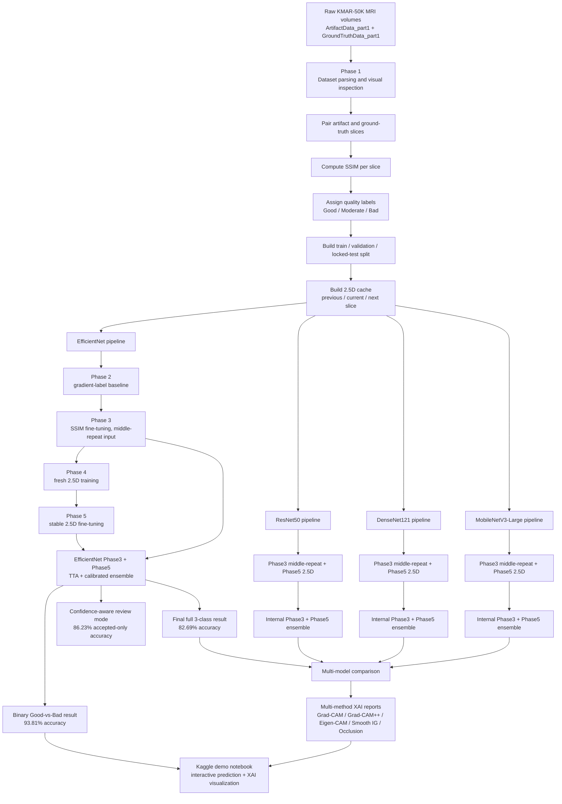
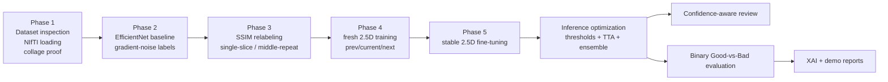
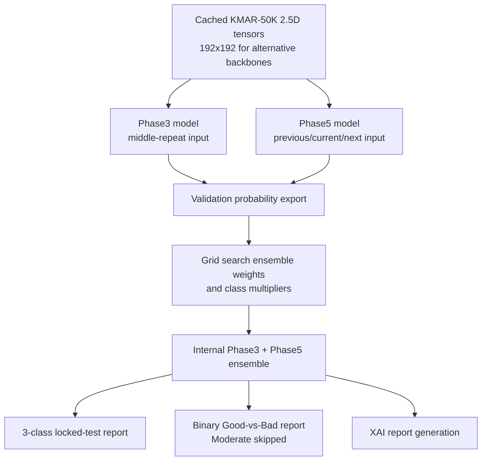
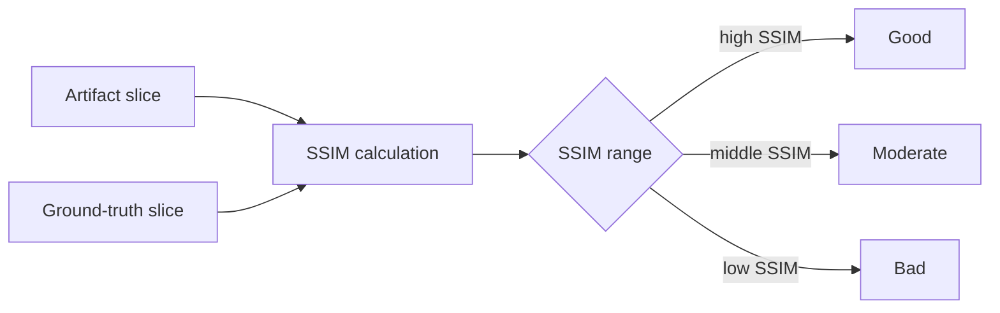
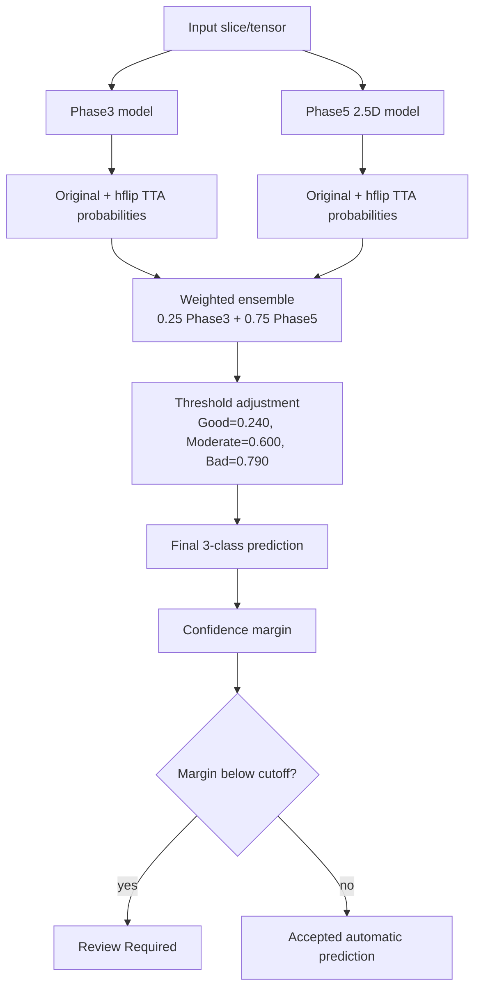
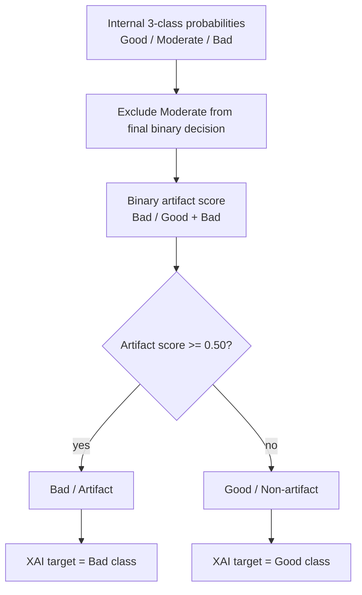
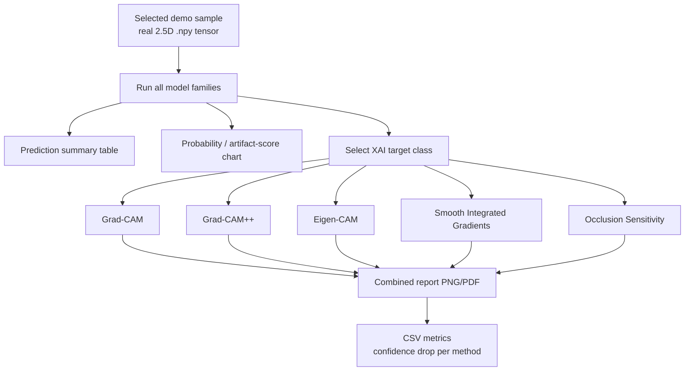
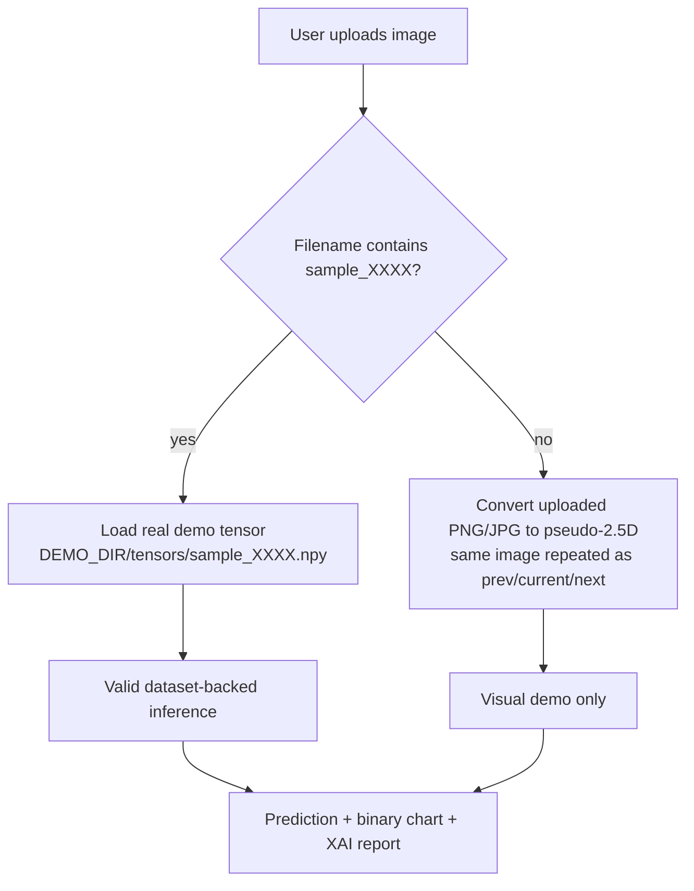

# KMAR-50K MRI Artifact Quality Classification

> **Multi-model knee MRI artifact-quality classification with SSIM labeling, 2.5D context, TTA, threshold calibration, internal phase ensembling, binary artifact-risk demo mode, and multi-method XAI reports.**

This repository documents the full KMAR-50K research workflow: dataset inspection, SSIM-based label construction, model training, multi-model benchmarking, confidence-aware evaluation, binary artifact-vs-non-artifact evaluation, and an interactive Kaggle demo notebook that produces prediction summaries and XAI visual reports.

The project started with an EfficientNet pipeline and was then extended to additional model families after supervisor feedback that the work should validate more than one architecture. The final repository therefore includes **EfficientNet, MobileNetV3-Large, DenseNet121, and ResNet50** results under a comparable Phase3 + Phase5 / internal-ensemble methodology.

---

## Live Resources

### Repository / Kaggle split

Large model checkpoints are intentionally **not** stored directly in GitHub.

```text
GitHub repository = code + scripts + reports + CSV summaries + documentation
Kaggle Model      = .pt model checkpoints and model-package metadata
Kaggle Dataset    = demo .npy tensors + preview images for notebook/XAI demonstration
```

This avoids GitHub binary-size problems and keeps the public project reproducible through Kaggle-hosted assets.

---

## Current Status

| Area | Status |
|---|---|
| EfficientNet final ensemble | Complete |
| MobileNetV3-Large Phase3 + Phase5 internal ensemble | Complete |
| DenseNet121 Phase3 + Phase5 internal ensemble | Complete |
| ResNet50 Phase3 + Phase5 internal ensemble | Complete |
| Multi-model XAI comparison | Complete for demo/sample reports |
| Interactive Kaggle notebook | Complete |
| Binary artifact-vs-non-artifact demo mode | Complete |
| Public Kaggle model package | Uploaded |
| Public Kaggle demo dataset | Uploaded |
| GitHub lightweight documentation/code push | Complete |

---

## Executive Summary

### Best full 3-class model

The strongest full 3-class result remains the **EfficientNet Phase3 + Phase5 calibrated TTA ensemble**.

| Metric | Value |
|---|---:|
| Locked-test samples | 3,120 |
| Quality accuracy | **82.69%** |
| Weighted F1 | **0.8246** |
| Macro F1 | **0.7458** |
| Plane accuracy | ~99.90% |
| Strategy | Phase3 + Phase5 probability ensemble |
| TTA | Original + horizontal flip |
| Phase3 weight | 0.25 |
| Phase5 weight | 0.75 |
| Thresholds | Good=0.240, Moderate=0.600, Bad=0.790 |

### Best confidence-aware operating point

| Metric | Value |
|---|---:|
| Automatic coverage | 88.91% |
| Review required | 11.09% |
| Accepted-only accuracy | **86.23%** |
| Accepted-only weighted F1 | **0.8602** |
| Accepted-only macro F1 | **0.7841** |
| Confidence score | margin |
| Margin cutoff | 0.107332 |

**Reporting rule:** use **82.69%** as the primary full-coverage locked-test result. Use **86.23%** only as accepted-only performance under confidence-aware review at 88.91% automatic coverage.

### Best binary artifact-vs-non-artifact result

A binary evaluation was also produced for clear Good-vs-Bad samples by excluding the Moderate class.

| Binary setting | Value |
|---|---:|
| Non-artifact class | Good |
| Artifact class | Bad |
| Moderate class | skipped |
| Samples | 2,584 |
| Accuracy | **93.81%** |
| Macro F1 | **0.8838** |
| Weighted F1 | **0.9367** |

Confusion matrix, rows=true and columns=predicted `[Non-artifact, Artifact]`:

```text
[[2095,  58],
 [ 102, 329]]
```

This should be described as **binary artifact severity detection**, not folder-origin artifact detection.

---

## Methodology Illustration — From Raw MRI to XAI Demo

This section summarizes the complete research methodology as a visual, step-by-step pipeline. The project is not a single-model experiment. It is a staged artifact-quality classification workflow that starts from raw KMAR-50K MRI volumes, constructs SSIM-based labels, trains multiple model families, calibrates predictions, evaluates full 3-class and binary artifact-risk performance, and finally generates XAI reports and an interactive Kaggle demo.

### Complete end-to-end workflow



### Training phase ladder

The EfficientNet work established the original phase structure. The later MobileNet, DenseNet, and ResNet experiments reuse the same core idea: train a Phase3-style single-slice/center-slice model, train a Phase5-style 2.5D contextual model, then combine them internally.



### What each phase contributed

| Stage | Main purpose | Input representation | Label source | Main output | Why it mattered |
|---|---|---|---|---|---|
| Phase 1 | Dataset inspection and preprocessing validation | Raw NIfTI volumes | Dataset pairing + visual inspection | Collages, dataset sanity checks, slice metadata | Proved that artifact and ground-truth volumes could be paired and inspected correctly |
| Phase 2 | First EfficientNet baseline | Current slice repeated across 3 channels | Gradient-noise heuristic | 79.1% baseline | Established a working multi-task classifier before SSIM relabeling |
| Phase 3 | SSIM-label fine-tuning | Current/middle slice repeated as 3 channels | SSIM thresholds | SSIM-aware Phase3 model | Learned stricter quality classes and became one half of the final ensemble |
| Phase 4 | 2.5D context exploration | Previous / current / next slice | SSIM thresholds | Fresh 2.5D model | Tested whether adjacent slices improve artifact severity classification |
| Phase 5 | Stable 2.5D fine-tuning | Previous / current / next slice | SSIM thresholds | Final Phase5 model | Produced the contextual model used in the final ensemble |
| Calibration | Correct probability imbalance | Model probabilities | Validation set only | thresholds / multipliers | Recovered performance from miscalibrated raw logits |
| TTA | More stable inference | original + horizontal flip | Locked test inference | averaged probabilities | Reduced prediction variance |
| Phase ensemble | Combine complementary views | Phase3 + Phase5 probabilities | Validation-tuned weights | final ensemble | Best full 3-class EfficientNet result |
| Confidence review | Separate uncertain predictions | adjusted score margin | locked-test inference | accepted/review split | Produced higher accepted-only accuracy at partial automation coverage |
| XAI | Explain predictions | model-specific target class | predicted class | heatmaps and confidence-drop tables | Makes results interpretable for reports and demo |

### Multi-model expansion methodology

After the EfficientNet result was complete, three additional backbones were trained to validate that the project was not dependent on a single architecture. The alternative backbones follow the same general Phase3 + Phase5 internal-ensemble pattern.



| Model family | Phase3 component | Phase5 component | Ensemble method | Final 3-class role | Binary demo role |
|---|---|---|---|---|---|
| EfficientNet-B0 | SSIM fine-tuned single-slice model | Stable 2.5D model | calibrated thresholds + TTA + weighted probability ensemble | Main best-performing model | Best binary artifact-vs-non-artifact system |
| MobileNetV3-Large | middle-repeat model | cached 2.5D model | validation-tuned weights + class multipliers | lightweight validation backbone | compact binary comparison model |
| DenseNet121 | middle-repeat model | cached 2.5D model | validation-tuned weights + class multipliers | strongest non-EfficientNet 3-class model | strongest non-EfficientNet binary model |
| ResNet50 | middle-repeat model | cached 2.5D model | validation-tuned weights + class multipliers | residual-network comparison model | additional binary comparison model |

### Labeling methodology

The final quality labels are SSIM-derived and are based on the structural similarity between artifact and ground-truth slices.



| Label | Meaning | Operational role |
|---|---|---|
| Good | visually/structurally close to ground truth | Non-artifact class in binary demo |
| Moderate | borderline or partially degraded | included in 3-class evaluation, excluded from binary demo decision |
| Bad | severe artifact/degradation | Artifact class in binary demo |

### Final 3-class inference methodology

The final EfficientNet 3-class model combines Phase3 and Phase5 probabilities, applies test-time augmentation, and uses calibrated decision thresholds.



### Binary demo methodology

The interactive demo can run in binary mode because this is easier to explain to non-technical users. It does not show Moderate as a final class. Instead, it computes an artifact-risk score from the internal 3-class probabilities.



| Binary field | Formula / rule | Interpretation |
|---|---|---|
| Good score | `Good / (Good + Bad)` | confidence that the slice is non-artifact |
| Bad / Artifact score | `Bad / (Good + Bad)` | confidence that the slice is artifact-risk |
| Threshold | `0.50` | above threshold means Bad / Artifact |
| Moderate | excluded | not used as final binary demo class |

For Moderate-labeled demo samples, binary truth is reported as `Not binary-evaluable` because Moderate is intentionally outside the Good-vs-Bad binary task.

### XAI methodology

The XAI stage compares multiple explanation methods across all trained model families. Each report is arranged as rows = model families and columns = XAI methods, so the same MRI sample can be visually compared across architectures.



| XAI method | Purpose in this project | How it is interpreted |
|---|---|---|
| Grad-CAM | Class-discriminative CNN heatmap | highlights regions driving the target class |
| Grad-CAM++ | sharper CAM variant for localized evidence | useful when artifacts are small or localized |
| Eigen-CAM | class-agnostic/eigenvector activation view | useful as a sanity-check activation map |
| Smooth Integrated Gradients | gradient attribution with smoothing | highlights pixel-level sensitivity; often noisier but informative |
| Occlusion Sensitivity | perturbation-based evidence test | masks regions and measures confidence drop |

XAI target rule:

| Report mode | XAI target |
|---|---|
| 3-class report | each model's predicted 3-class label |
| Binary demo report | predicted binary class: Good target if Good / Non-artifact, Bad target if Bad / Artifact |

### Kaggle demo input methodology

The public Kaggle notebook supports two input modes.



| Input type | What notebook does | Validity |
|---|---|---|
| `sample_0007_current.png` or `sample_0007_triptych.png` | detects `sample_0007` and loads the real `.npy` tensor | valid demo dataset inference |
| arbitrary MRI PNG/JPG | converts image to pseudo-2.5D by repeating the same 2D image | visual demo only |
| direct `.npy` demo tensor | uses real 2.5D tensor | valid demo dataset inference |

This design prevents a common mistake: using a preview PNG as if it were the real model tensor. The correct demo path is to use the filename only as an identifier and then load the true 2.5D tensor from the Kaggle demo dataset.

### Output artifacts produced by the methodology

| Output | Location / example | Purpose |
|---|---|---|
| model checkpoints | Kaggle Model package | stores large `.pt` files outside GitHub |
| demo tensors | Kaggle Dataset package | stores small `.npy` samples and preview images |
| 3-class reports | `xai_multi_model_outputs/` or Kaggle working folder | full model/method comparison |
| binary demo reports | `/kaggle/working/kmar50k_uploaded_binary_demo/` | simplified Good-vs-Bad demo output |
| prediction CSV | `*_predictions.csv` | machine-readable model probabilities |
| XAI metrics CSV | `*_xai_metrics.csv` | confidence-drop metrics by explanation method |
| summary CSV | `*_summary.csv` | consensus label, agreement, artifact score |


## Model Comparison Summary

### Full 3-class locked-test comparison

| Rank | Model family | Backbone | Final strategy | Accuracy | Weighted F1 | Macro F1 | Notes |
|---:|---|---|---|---:|---:|---:|---|
| 1 | EfficientNet | EfficientNet-B0 | Phase3 + Phase5 calibrated TTA ensemble | **82.69%** | **0.8246** | **0.7458** | Best full 3-class system |
| 2 | DenseNet121 | DenseNet121 | Internal Phase3 + Phase5 ensemble | 74.62% | 0.7332 | 0.6132 | Best among newly tested alternative backbones |
| 3 | MobileNetV3-Large | MobileNetV3-Large | Internal Phase3 + Phase5 ensemble | 73.65% | 0.7276 | 0.5961 | Lightweight model; strong speed/size trade-off |
| 4 | ResNet50 | ResNet50 | Internal Phase3 + Phase5 ensemble | 73.40% | 0.7205 | 0.5915 | Larger checkpoint; similar accuracy to MobileNet |

### Binary Good-vs-Bad comparison

| Rank | Model family | Samples | Binary accuracy | Weighted F1 | Macro F1 | Notes |
|---:|---|---:|---:|---:|---:|---|
| 1 | EfficientNet final ensemble | 2,584 | **93.81%** | **0.9367** | **0.8838** | Best binary artifact-vs-non-artifact system |
| 2 | DenseNet121 internal ensemble | 2,555 | 88.30% | 0.8765 | 0.7707 | Strongest non-EfficientNet binary result |
| 3 | ResNet50 internal ensemble | 2,555 | 87.87% | 0.8713 | 0.7599 | Slightly higher than MobileNet in binary accuracy |
| 4 | MobileNetV3-Large internal ensemble | 2,555 | 87.71% | 0.8698 | 0.7573 | Compact and efficient alternative |

### Architecture notes

| Model | Role in project | Input size | Phase3/Phase5 weights | Calibration / multipliers |
|---|---|---:|---|---|
| EfficientNet-B0 | Main final research model | 224 | 0.25 / 0.75 | thresholds: `[0.240, 0.600, 0.790]` |
| MobileNetV3-Large | Lightweight alternative model | 192 | 0.70 / 0.30 | multipliers: `[1.70, 1.10, 0.90]` |
| DenseNet121 | Alternative dense-feature model | 192 | 0.70 / 0.30 | multipliers: `[2.38, 2.54, 1.42]` |
| ResNet50 | Alternative residual model | 192 | 0.57 / 0.43 | multipliers: `[2.02, 1.94, 1.86]` |

---

## Dataset

The original KMAR-50K data contains paired artifact and ground-truth knee MRI volumes.

```text
ArtifactData_part1/
GroundTruthData_part1/
Testing _GroundTruthData/
TrainingCohort.csv
TestingCohort.csv
```

The project predicts two tasks during training:

| Task | Classes |
|---|---|
| Quality classification | Good, Moderate, Bad |
| Plane classification | Sagittal, Coronal, Transection |

### Main split

| Split | Samples |
|---|---:|
| Train | 22,054 |
| Validation | 6,332 |
| Locked test | 3,120 |

### Locked-test support used for the final EfficientNet ensemble

| Class | Support |
|---|---:|
| Good | 2,153 |
| Moderate | 536 |
| Bad | 431 |

### Demo dataset package

The public Kaggle demo sample dataset is separate from the full source dataset. It is designed for notebook demonstration and public inference/XAI visualization.

| Item | Value |
|---|---:|
| Demo samples | 45 |
| Good samples | 15 |
| Moderate samples | 15 |
| Bad samples | 15 |
| Tensor format | `.npy` |
| Tensor shape | `(3, 192, 192)` |
| Tensor dtype | `uint8` |
| Preview images | current-slice PNG + triptych PNG |
| Preview count | 90 |

Plane distribution in the demo sample dataset:

| Plane | Count |
|---|---:|
| Coronal | 19 |
| Sagittal | 17 |
| Transection | 9 |

Important demo rule:

```text
If the user uploads sample_XXXX_current.png or sample_XXXX_triptych.png,
the notebook detects sample_XXXX and loads the real tensor:
/kaggle/input/.../tensors/sample_XXXX.npy

The uploaded PNG is used only to identify the sample, not as the model input.
```

For arbitrary uploaded PNG/JPG files, the notebook falls back to pseudo-2.5D mode where the same 2D image is repeated as previous/current/next. That mode is marked **visual-demo-only**.

---

## Visual Dataset Evidence

The following images should be present under `readme_assets/`.


---

## Labeling Strategy

### Initial gradient-noise baseline

The early baseline used a handcrafted gradient-noise score computed from MRI slice gradients.

```python
def gradient_noise_score(slice_2d):
    s = normalize(slice_2d)
    gx = np.gradient(s, axis=1)
    gy = np.gradient(s, axis=0)
    m = np.stack([gx.flatten(), gy.flatten()], axis=1)
    c = (m.T @ m) / m.shape[0]
    return float(np.trace(c))
```

This produced a useful baseline, but it was weaker for final reporting because a middle-slice-derived score could propagate noise into adjacent slice labels.

### SSIM labeling

Later phases used SSIM between artifact and ground-truth slices.

```text
Good     : SSIM >= 0.789
Moderate : 0.649 <= SSIM < 0.789
Bad      : SSIM < 0.649
```

SSIM-based labels became the final benchmark basis for Phase3, Phase4, Phase5, and all later model comparisons.

---

## Pipeline Overview

```text
Raw paired MRI volumes
        ↓
NIfTI parsing and slice extraction
        ↓
Artifact/ground-truth pairing
        ↓
SSIM calculation and quality labels
        ↓
Train/validation/locked-test split
        ↓
Phase3 single-slice SSIM training
        ↓
Phase5 2.5D previous/current/next training
        ↓
TTA with original + horizontal flip
        ↓
Threshold / multiplier calibration on validation data
        ↓
Phase3 + Phase5 probability ensembling
        ↓
Locked-test evaluation
        ↓
Confidence-aware review mode
        ↓
Binary Good-vs-Bad artifact-risk mode
        ↓
XAI reports: Grad-CAM, Grad-CAM++, Eigen-CAM, Smooth IG, Occlusion
        ↓
Kaggle public demo notebook
```


---

## Training Phases

### Phase 1 — dataset inspection and preprocessing

Purpose:

- load NIfTI files
- validate artifact/ground-truth pairings
- inspect scan shapes and planes
- generate visual collages
- prepare metadata
- build early preprocessing scripts

Important scripts:

```text
phase1_dataset.py
explore_dataset.py
csv_read.py
grab_image.py
collage_creator.py
case_study_preprocessing.py
SSIM_analysis.py
build_samples_ssim.py
```

### Phase 2 — gradient-label EfficientNet baseline

| Component | Value |
|---|---|
| Backbone | EfficientNet-B0 |
| Input | single-slice 3-channel stack |
| Labels | gradient-noise labels |
| Loss | CrossEntropy + class weights |
| LR | 5e-5 |
| Batch size | 8 |
| Scheduler | CosineAnnealingWarmRestarts |
| Best epoch | 9 |
| Baseline test accuracy | 79.1% |

### Phase 3 — SSIM fine-tuning

| Component | Value |
|---|---|
| Backbone | EfficientNet-B0 / later MobileNet, DenseNet, ResNet variants |
| Input | current slice repeated as 3 channels |
| Labels | SSIM labels |
| Role | ensemble component |

Phase3 captures current-slice SSIM features and provides complementary predictions for Phase5.

### Phase 4 — fresh 2.5D research model

| Component | Value |
|---|---|
| Input | previous/current/next slice |
| Labels | SSIM labels |
| Loss | Focal Loss |
| Purpose | introduce local slice context |

Phase4 was exploratory and not the final model, but it led to Phase5.

### Phase 5 — stable 2.5D model

| Component | Value |
|---|---|
| Input | previous/current/next slice |
| Labels | SSIM labels |
| Role | final ensemble component |

Phase5 alone was initially miscalibrated, but validation calibration and Phase3/Phase5 ensembling recovered strong performance.

---

## EfficientNet Final Result

### Full 3-class locked-test result

| Metric | Value |
|---|---:|
| Accuracy | **82.69%** |
| Weighted F1 | **0.8246** |
| Macro F1 | **0.7458** |
| Samples | 3,120 |
| Strategy | Phase3 + Phase5 probability ensemble |
| TTA | original + hflip |

Final per-class metrics:

| Class | Precision | Recall | F1-score | Support |
|---|---:|---:|---:|---:|
| Good | 0.8855 | 0.9085 | 0.8968 | 2,153 |
| Moderate | 0.6369 | 0.5858 | 0.6103 | 536 |
| Bad | 0.7416 | 0.7193 | 0.7303 | 431 |

### Confidence-aware review result

| Metric | Value |
|---|---:|
| Accepted samples | 2,774 / 3,120 |
| Review required | 346 / 3,120 |
| Coverage | 88.91% |
| Accepted-only accuracy | **86.23%** |
| Accepted-only weighted F1 | **0.8602** |
| Accepted-only macro F1 | **0.7841** |

---

## Alternative Model Results

The alternative models were trained to demonstrate that the pipeline was not limited to one architecture.

### MobileNetV3-Large

Best internal Phase3 + Phase5 ensemble:

| Metric | Value |
|---|---:|
| Full 3-class accuracy | 73.65% |
| Weighted F1 | 0.7276 |
| Macro F1 | 0.5961 |
| Binary Good-vs-Bad accuracy | 87.71% |
| Binary weighted F1 | 0.8698 |
| Binary macro F1 | 0.7573 |
| Phase3 weight | 0.70 |
| Phase5 weight | 0.30 |
| Multipliers | `[1.70, 1.10, 0.90]` |

3-class confusion matrix:

```text
[[1865, 167,  88],
 [ 242, 242,  81],
 [ 160,  84, 191]]
```

Binary confusion matrix, rows=true and columns=predicted `[Non-artifact, Artifact]`:

```text
[[2018, 102],
 [ 212, 223]]
```

### DenseNet121

Best internal Phase3 + Phase5 ensemble:

| Metric | Value |
|---|---:|
| Full 3-class accuracy | **74.62%** |
| Weighted F1 | **0.7332** |
| Macro F1 | **0.6132** |
| Binary Good-vs-Bad accuracy | **88.30%** |
| Binary weighted F1 | **0.8765** |
| Binary macro F1 | **0.7707** |
| Phase3 weight | 0.70 |
| Phase5 weight | 0.30 |
| Multipliers | `[2.38, 2.54, 1.42]` |

3-class confusion matrix:

```text
[[1892, 133,  95],
 [ 296, 236,  33],
 [ 162,  73, 200]]
```

Binary confusion matrix, rows=true and columns=predicted `[Non-artifact, Artifact]`:

```text
[[2022,  98],
 [ 201, 234]]
```

### ResNet50

Best internal Phase3 + Phase5 ensemble:

| Metric | Value |
|---|---:|
| Full 3-class accuracy | 73.40% |
| Weighted F1 | 0.7205 |
| Macro F1 | 0.5915 |
| Binary Good-vs-Bad accuracy | 87.87% |
| Binary weighted F1 | 0.8713 |
| Binary macro F1 | 0.7599 |
| Phase3 weight | 0.57 |
| Phase5 weight | 0.43 |
| Multipliers | `[2.02, 1.94, 1.86]` |

3-class confusion matrix:

```text
[[1879, 156,  85],
 [ 288, 204,  73],
 [ 165,  63, 207]]
```

Binary confusion matrix, rows=true and columns=predicted `[Non-artifact, Artifact]`:

```text
[[2021,  99],
 [ 211, 224]]
```

---

## Graph Evidence Gallery

These figures should be stored in `readme_assets/` or generated into `research_plots/figures/` and copied into `readme_assets/`.

### Final strategy plots


### Confusion matrices


### Confidence-aware plots


### Plane and volume plots


### Training curves


---


---

## Complete Model Evidence Gallery — Confusion Matrices and Learning Curves

This section is the evidence layer for the multi-model claim. The project does not only report final numbers; it preserves the visual training/evaluation artifacts for every trained model family and phase.

The assets should be copied into the repository under:

```text
readme_assets/model_evidence/confusion_matrices/
readme_assets/model_evidence/learning_curves/
results/model_evidence/
```

### One-command evidence copy script

Run this from **PowerShell** on the Windows machine where the training outputs exist.

```powershell
cd D:\KMAR-50K\uzair_researchProject

$SRC  = "D:\KMAR-50K\KMAR-50K"
$REPO = "D:\KMAR-50K\uzair_researchProject"

$CM_OUT      = Join-Path $REPO "readme_assets\model_evidence\confusion_matrices"
$CURVE_OUT   = Join-Path $REPO "readme_assets\model_evidence\learning_curves"
$REPORT_OUT  = Join-Path $REPO "results\model_evidence"
$HISTORY_OUT = Join-Path $REPORT_OUT "histories"

New-Item -ItemType Directory -Force -Path $CM_OUT, $CURVE_OUT, $REPORT_OUT, $HISTORY_OUT | Out-Null

function Copy-RequiredFile {
    param(
        [string]$Source,
        [string]$Dest
    )
    if (Test-Path $Source) {
        Copy-Item $Source $Dest -Force
        Write-Host "COPIED: $Dest"
    } else {
        Write-Host "MISSING: $Source" -ForegroundColor Yellow
    }
}

# ============================================================
# EfficientNet final / primary model evidence
# ============================================================
# Existing final research plots are kept in readme_assets/ by the earlier graph-generation stage.
# Copy any final EfficientNet confusion/evaluation plots that are present.
New-Item -ItemType Directory -Force -Path "$CM_OUT\efficientnet" | Out-Null
Get-ChildItem "$SRC\FINAL_MODEL_82_69_CONFIDENCE_86_23" -File -Include "*confusion*.png", "*matrix*.png" -Recurse -ErrorAction SilentlyContinue |
    Copy-Item -Destination "$CM_OUT\efficientnet" -Force

Get-ChildItem "$SRC\binary_artifact_nonartifact" -File -Include "*confusion*.png", "*matrix*.png" -Recurse -ErrorAction SilentlyContinue |
    Copy-Item -Destination "$CM_OUT\efficientnet" -Force

# ============================================================
# MobileNetV3-Large evidence
# ============================================================
Copy-RequiredFile "$SRC\checkpoints_mobilenet_phases\mobilenet_phase3_middle_repeat_mobilenetv3_large_100_img192_bs4\final_confusion_matrix.png" `
                  "$CM_OUT\mobilenet_phase3_confusion_matrix.png"
Copy-RequiredFile "$SRC\checkpoints_mobilenet_cached\mobilenet_cached_multiclass_quality_mobilenetv3_large_100_img192_bs4\final_confusion_matrix.png" `
                  "$CM_OUT\mobilenet_phase5_confusion_matrix.png"
Copy-RequiredFile "$SRC\checkpoints_mobilenet_phases\mobilenet_internal_phase3_phase5_ensemble\mobilenet_internal_phase3_phase5_ensemble_tuned_confusion_matrix.png" `
                  "$CM_OUT\mobilenet_internal_ensemble_3class_confusion_matrix.png"
Copy-RequiredFile "$SRC\checkpoints_mobilenet_phases\mobilenet_internal_phase3_phase5_ensemble\mobilenet_internal_phase3_phase5_ensemble_tuned_binary_good_bad_confusion_matrix.png" `
                  "$CM_OUT\mobilenet_internal_ensemble_binary_confusion_matrix.png"

Copy-RequiredFile "$SRC\checkpoints_mobilenet_phases\mobilenet_phase3_middle_repeat_mobilenetv3_large_100_img192_bs4\history.json" `
                  "$HISTORY_OUT\mobilenet_phase3_history.json"
Copy-RequiredFile "$SRC\checkpoints_mobilenet_cached\mobilenet_cached_multiclass_quality_mobilenetv3_large_100_img192_bs4\history.json" `
                  "$HISTORY_OUT\mobilenet_phase5_history.json"

# ============================================================
# DenseNet121 evidence
# ============================================================
Copy-RequiredFile "$SRC\checkpoints_densenet_phases\densenet_phase3_middle_repeat_densenet121_img192_bs2\final_confusion_matrix.png" `
                  "$CM_OUT\densenet_phase3_confusion_matrix.png"
Copy-RequiredFile "$SRC\checkpoints_densenet_phases\densenet_phase5_2p5d_densenet121_img192_bs2\final_confusion_matrix.png" `
                  "$CM_OUT\densenet_phase5_confusion_matrix.png"
Copy-RequiredFile "$SRC\checkpoints_densenet_phases\densenet_internal_phase3_phase5_ensemble\densenet_internal_phase3_phase5_ensemble_tuned_confusion_matrix.png" `
                  "$CM_OUT\densenet_internal_ensemble_3class_confusion_matrix.png"
Copy-RequiredFile "$SRC\checkpoints_densenet_phases\densenet_internal_phase3_phase5_ensemble\densenet_internal_phase3_phase5_ensemble_tuned_binary_good_bad_confusion_matrix.png" `
                  "$CM_OUT\densenet_internal_ensemble_binary_confusion_matrix.png"

Copy-RequiredFile "$SRC\checkpoints_densenet_phases\densenet_phase3_middle_repeat_densenet121_img192_bs2\history.json" `
                  "$HISTORY_OUT\densenet_phase3_history.json"
Copy-RequiredFile "$SRC\checkpoints_densenet_phases\densenet_phase5_2p5d_densenet121_img192_bs2\history.json" `
                  "$HISTORY_OUT\densenet_phase5_history.json"

# ============================================================
# ResNet50 evidence
# ============================================================
Copy-RequiredFile "$SRC\checkpoints_resnet_phases\resnet_phase3_middle_repeat_resnet50_img192_bs2\final_confusion_matrix.png" `
                  "$CM_OUT\resnet_phase3_confusion_matrix.png"
Copy-RequiredFile "$SRC\checkpoints_resnet_phases\resnet_phase5_2p5d_resnet50_img192_bs2\final_confusion_matrix.png" `
                  "$CM_OUT\resnet_phase5_confusion_matrix.png"
Copy-RequiredFile "$SRC\checkpoints_resnet_phases\resnet_internal_phase3_phase5_ensemble\resnet_internal_phase3_phase5_ensemble_tuned_confusion_matrix.png" `
                  "$CM_OUT\resnet_internal_ensemble_3class_confusion_matrix.png"
Copy-RequiredFile "$SRC\checkpoints_resnet_phases\resnet_internal_phase3_phase5_ensemble\resnet_internal_phase3_phase5_ensemble_tuned_binary_good_bad_confusion_matrix.png" `
                  "$CM_OUT\resnet_internal_ensemble_binary_confusion_matrix.png"

Copy-RequiredFile "$SRC\checkpoints_resnet_phases\resnet_phase3_middle_repeat_resnet50_img192_bs2\history.json" `
                  "$HISTORY_OUT\resnet_phase3_history.json"
Copy-RequiredFile "$SRC\checkpoints_resnet_phases\resnet_phase5_2p5d_resnet50_img192_bs2\history.json" `
                  "$HISTORY_OUT\resnet_phase5_history.json"

# ============================================================
# Also copy final text/json reports for auditability
# ============================================================
Get-ChildItem "$SRC\checkpoints_mobilenet_phases\mobilenet_internal_phase3_phase5_ensemble" -File -Include "*.txt", "*.json", "*.csv" -Recurse -ErrorAction SilentlyContinue |
    Copy-Item -Destination $REPORT_OUT -Force
Get-ChildItem "$SRC\checkpoints_densenet_phases\densenet_internal_phase3_phase5_ensemble" -File -Include "*.txt", "*.json", "*.csv" -Recurse -ErrorAction SilentlyContinue |
    Copy-Item -Destination $REPORT_OUT -Force
Get-ChildItem "$SRC\checkpoints_resnet_phases\resnet_internal_phase3_phase5_ensemble" -File -Include "*.txt", "*.json", "*.csv" -Recurse -ErrorAction SilentlyContinue |
    Copy-Item -Destination $REPORT_OUT -Force
Get-ChildItem "$SRC\FINAL_MODEL_82_69_CONFIDENCE_86_23" -File -Include "*.txt", "*.json", "*.csv" -Recurse -ErrorAction SilentlyContinue |
    Copy-Item -Destination $REPORT_OUT -Force

Write-Host "Evidence copy complete."
Write-Host "Confusion matrices: $CM_OUT"
Write-Host "Histories          : $HISTORY_OUT"
Write-Host "Reports            : $REPORT_OUT"
```

### Generate learning-curve PNGs from copied histories

The following command writes a small Python utility and generates training curves from each copied `history.json`. It is intentionally flexible because some history files use different metric-key names.

```powershell
cd D:\KMAR-50K\uzair_researchProject

@'
from pathlib import Path
import json
import math
import matplotlib.pyplot as plt

REPO = Path(r"D:\KMAR-50K\uzair_researchProject")
HISTORY_DIR = REPO / "results" / "model_evidence" / "histories"
OUT_DIR = REPO / "readme_assets" / "model_evidence" / "learning_curves"
OUT_DIR.mkdir(parents=True, exist_ok=True)

PREFERRED_KEYS = [
    "train_loss", "val_loss", "loss",
    "train_quality_acc", "val_quality_acc", "quality_acc", "val_acc", "accuracy",
    "train_plane_acc", "val_plane_acc", "plane_acc",
    "weighted_f1", "macro_f1", "val_weighted_f1", "val_macro_f1",
]

ALIASES = {
    "train_loss": "Train loss",
    "val_loss": "Validation loss",
    "loss": "Loss",
    "train_quality_acc": "Train quality accuracy",
    "val_quality_acc": "Validation quality accuracy",
    "quality_acc": "Quality accuracy",
    "val_acc": "Validation accuracy",
    "accuracy": "Accuracy",
    "train_plane_acc": "Train plane accuracy",
    "val_plane_acc": "Validation plane accuracy",
    "plane_acc": "Plane accuracy",
    "weighted_f1": "Weighted F1",
    "macro_f1": "Macro F1",
    "val_weighted_f1": "Validation weighted F1",
    "val_macro_f1": "Validation macro F1",
}

def as_list_history(obj):
    if isinstance(obj, list):
        return obj
    if isinstance(obj, dict):
        for key in ["history", "epochs", "records", "log"]:
            if key in obj and isinstance(obj[key], list):
                return obj[key]
        # dict of metric -> list
        if any(isinstance(v, list) for v in obj.values()):
            n = max(len(v) for v in obj.values() if isinstance(v, list))
            rows = []
            for i in range(n):
                row = {"epoch": i + 1}
                for k, v in obj.items():
                    if isinstance(v, list) and i < len(v):
                        row[k] = v[i]
                rows.append(row)
            return rows
    return []

def numeric_series(rows, key):
    xs, ys = [], []
    for i, r in enumerate(rows):
        if not isinstance(r, dict) or key not in r:
            continue
        try:
            y = float(r[key])
        except Exception:
            continue
        if math.isnan(y) or math.isinf(y):
            continue
        epoch = r.get("epoch", r.get("epoch_index", i + 1))
        try:
            epoch = int(epoch)
        except Exception:
            epoch = i + 1
        xs.append(epoch)
        ys.append(y)
    return xs, ys

created = []
for hist_path in sorted(HISTORY_DIR.glob("*_history.json")):
    try:
        data = json.loads(hist_path.read_text(encoding="utf-8"))
    except Exception as e:
        print(f"SKIP {hist_path.name}: cannot read json: {e}")
        continue

    rows = as_list_history(data)
    if not rows:
        print(f"SKIP {hist_path.name}: no epoch records found")
        continue

    # collect numeric keys present in records
    present = []
    for key in PREFERRED_KEYS:
        xs, ys = numeric_series(rows, key)
        if len(xs) >= 2:
            present.append(key)

    if not present:
        # fallback: any numeric key with at least 2 points
        keys = sorted({k for r in rows if isinstance(r, dict) for k in r.keys()})
        for key in keys:
            xs, ys = numeric_series(rows, key)
            if len(xs) >= 2 and key not in ["epoch", "epoch_index"]:
                present.append(key)

    if not present:
        print(f"SKIP {hist_path.name}: no plottable numeric metrics")
        continue

    plt.figure(figsize=(10, 5.5))
    for key in present:
        xs, ys = numeric_series(rows, key)
        label = ALIASES.get(key, key)
        plt.plot(xs, ys, marker="o", linewidth=1.8, label=label)

    title = hist_path.stem.replace("_history", "").replace("_", " ").title()
    plt.title(f"{title} learning curve")
    plt.xlabel("Epoch")
    plt.ylabel("Metric value")
    plt.grid(alpha=0.3)
    plt.legend(fontsize=8)
    plt.tight_layout()

    out = OUT_DIR / f"{hist_path.stem.replace('_history', '')}_learning_curve.png"
    plt.savefig(out, dpi=170)
    plt.close()
    created.append(out)
    print(f"CREATED: {out}")

print(f"Created {len(created)} learning-curve PNG files.")
'@ | Set-Content scripts\generate_readme_learning_curves.py -Encoding UTF8

python scripts\generate_readme_learning_curves.py
```

### Commit evidence assets

After copying and generating the figures, commit only the lightweight `.png`, `.json`, `.csv`, `.txt`, and script files. Do not commit `.pt` model weights.

```powershell
cd D:\KMAR-50K\uzair_researchProject

git add readme_assets\model_evidence results\model_evidence scripts\generate_readme_learning_curves.py README.md
git status
git diff --cached --name-only | findstr /i "\.pt \.pth \.ckpt \.safetensors"

# If the findstr command prints nothing, commit safely.
git commit -m "Add model evidence confusion matrices and learning curves"
git push origin main
```

### Model-family confusion-matrix gallery

The files below are the intended final asset names after running the copy script.

#### MobileNetV3-Large

| Evidence | Image |
|---|---|
| Phase3 middle-repeat confusion matrix |  |
| Phase5 2.5D confusion matrix |  |
| Internal Phase3+Phase5 3-class ensemble confusion matrix |  |
| Internal Phase3+Phase5 binary Good-vs-Bad confusion matrix |  |

#### DenseNet121

| Evidence | Image |
|---|---|
| Phase3 middle-repeat confusion matrix |  |
| Phase5 2.5D confusion matrix |  |
| Internal Phase3+Phase5 3-class ensemble confusion matrix |  |
| Internal Phase3+Phase5 binary Good-vs-Bad confusion matrix |  |

#### ResNet50

| Evidence | Image |
|---|---|
| Phase3 middle-repeat confusion matrix |  |
| Phase5 2.5D confusion matrix |  |
| Internal Phase3+Phase5 3-class ensemble confusion matrix |  |
| Internal Phase3+Phase5 binary Good-vs-Bad confusion matrix |  |

#### EfficientNet primary model

EfficientNet is the primary final model. Its graph evidence is mostly produced by the final research-graph generator and stored under the existing `readme_assets/` names already shown in the graph gallery. Additional confusion/matrix files copied from `FINAL_MODEL_82_69_CONFIDENCE_86_23/` and `binary_artifact_nonartifact/` should appear under:

```text
readme_assets/model_evidence/confusion_matrices/efficientnet/
```

This separation is intentional because EfficientNet uses the final calibrated TTA/threshold ensemble workflow rather than the later MobileNet/DenseNet/ResNet internal-ensemble script layout.

### Per-model learning-curve gallery

The following learning-curve images are generated from each model phase's `history.json`.

| Model phase | Learning curve |
|---|---|
| MobileNetV3-Large Phase3 |  |
| MobileNetV3-Large Phase5 |  |
| DenseNet121 Phase3 |  |
| DenseNet121 Phase5 |  |
| ResNet50 Phase3 |  |
| ResNet50 Phase5 |  |

### Why these figures matter

The confusion matrices and learning curves support three claims:

1. **Model comparison was real, not cosmetic.** MobileNetV3-Large, DenseNet121, and ResNet50 each have their own trained Phase3 and Phase5 checkpoints, internal-ensemble evaluation, and confusion matrices.
2. **Training behavior is auditable.** The copied `history.json` files and generated learning curves show how loss/accuracy/F1 evolved across epochs for every available model phase.
3. **Final model choice is justified.** EfficientNet remains the best full 3-class model, while DenseNet121 is the strongest alternative among the later comparable Phase3+Phase5 internal-ensemble models.


## XAI Methods

The notebook/report generator supports five XAI methods:

| XAI method | Type | Strength | Weakness | Best use in this project |
|---|---|---|---|---|
| Grad-CAM | CAM-based localization | Simple, recognizable heatmaps | Can be broad | Baseline visual explanation |
| Grad-CAM++ | CAM-based localization | Often sharper than Grad-CAM | May still highlight broad regions | Preferred CAM variant for reports |
| Eigen-CAM | PCA/CAM-style | Stable and visually smooth | Less class-specific | Good visual localization comparison |
| Smooth Integrated Gradients | gradient attribution | Captures fine-grained sensitivity | Can look noisy | Pixel/sensitivity evidence |
| Occlusion Sensitivity | perturbation/faithfulness | Strong confidence-drop evidence | Blocky/coarse | Best for quantitative faithfulness |

### XAI interpretation rule

XAI explains **the model's predicted class**, not the dataset label.

Example:

```text
If a Good sample is predicted as Moderate,
Grad-CAM explains why the model predicted Moderate.
It does not explain why the ground-truth label is Good.
```

### Practical XAI finding

- **Occlusion Sensitivity** is the most faithful method because it directly measures confidence drop after masking image regions.
- **Grad-CAM++** and **Eigen-CAM** are usually more readable for visual reporting.
- **Smooth Integrated Gradients** can be useful but is noisier and should be interpreted carefully.
- The final demo notebook uses the XAI report as a model-behavior explanation, not as clinical diagnosis evidence.

---

## Kaggle Demo Notebook

The public notebook demonstrates the models without requiring local training.

Notebook:

```text
https://www.kaggle.com/code/zeeshankhalid5559/kmar-checkpoints-demo
```

Inputs:

| Input | Kaggle source |
|---|---|
| Model weights | `kmar50k-multi-model-artifact-quality-checkpoints` |
| Demo samples | `kmar50k-xai-demo-samples` |

### Notebook features

| Feature | Description |
|---|---|
| Path verification | Confirms Kaggle model and dataset paths |
| Model loading | Loads EfficientNet, MobileNetV3-Large, DenseNet121, ResNet50 Phase3/Phase5 checkpoints |
| Demo sample preview | Shows current-slice and triptych sample previews |
| 3-class batch reporting | Generates multi-model 3-class reports for selected demo samples |
| 24-case balanced reports | Generates 8 Good + 8 Moderate + 8 Bad reports |
| Binary artifact demo | Predicts only Good/Non-artifact vs Bad/Artifact |
| Upload UI | Lets user upload preview image or arbitrary image |
| Real tensor detection | Detects `sample_XXXX` and loads the real `.npy` tensor |
| XAI report | Produces PNG/PDF report with Grad-CAM, Grad-CAM++, Eigen-CAM, Smooth IG, and Occlusion |

### Binary demo logic

The binary demo excludes Moderate from the final decision:

```python
artifact_score = bad_probability / (good_probability + bad_probability)

if artifact_score >= 0.50:
    prediction = "Bad / Artifact"
else:
    prediction = "Good / Non-artifact"
```

For Moderate samples, binary ground truth is marked:

```text
Not binary-evaluable
```

This is intentional. The binary demo is for Good-vs-Bad artifact-risk demonstration, not Moderate boundary evaluation.

### Valid demo input behavior

| Uploaded file | Notebook behavior | Validity |
|---|---|---|
| `sample_0007_current.png` | detects `sample_0007`, loads `tensors/sample_0007.npy` | valid demo tensor |
| `sample_0007_triptych.png` | detects `sample_0007`, loads `tensors/sample_0007.npy` | valid demo tensor |
| arbitrary `.png` / `.jpg` | converts to pseudo-2.5D by repeating same image | visual-demo-only |

---

## Example Demo Outputs

### Binary artifact decision chart

This is the preferred chart for the final demo because it clearly shows the binary artifact score and the 0.50 decision threshold.


Interpretation example:

```text
True label: Good / Non-artifact
Consensus: Good / Non-artifact
All model artifact scores are below 0.50.
Final binary decision is correct.
```

### Multi-model XAI report example


Note: if this report is generated from the older 3-class batch cell, it may show Good/Moderate/Bad. For the final public demo, prefer the binary report generated by Cell 7.

---

## Folder Structure

Current repository-level structure:

```text
uzair_researchProject/
├── README.md
├── DATA_NOTICE.md
├── requirements.txt
├── .gitignore
├── .gitattributes
├── scripts/
├── results/
├── models/
│   ├── MODEL_WEIGHTS.md
│   ├── README_KAGGLE_MODEL_UPLOAD.md
│   └── SHA256_MANIFEST.csv
├── checkpoints/                  # lightweight result files only; no .pt intended
├── binary_artifact_nonartifact/
├── research_plots/
├── readme_assets/
├── tex_creation/
├── xai_outputs/
└── core training/evaluation scripts
```

Important local full project folders before lightweight GitHub packaging:

```text
D:\KMAR-50K\KMAR-50K\checkpoints
D:\KMAR-50K\KMAR-50K\checkpoints_mobilenet_phases
D:\KMAR-50K\KMAR-50K\checkpoints_densenet_phases
D:\KMAR-50K\KMAR-50K\checkpoints_resnet_phases
D:\KMAR-50K\KMAR-50K\FINAL_MODEL_82_69_CONFIDENCE_86_23
D:\KMAR-50K\KMAR-50K\KMAR50K_KAGGLE_MODEL_UPLOAD
D:\KMAR-50K\KMAR-50K\KMAR50K_XAI_DEMO_SAMPLES_PUBLIC
D:\KMAR-50K\KMAR-50K\xai_multi_model_outputs
```

---

## Model Weights

Model weights are stored in the public Kaggle Model package, not in GitHub.

Expected Kaggle model package layout:

```text
KMAR50K_KAGGLE_MODEL_UPLOAD/
├── efficientnet/
│   ├── efficientnet_phase3_best_model_ssim.pt
│   ├── efficientnet_phase5_best_model.pt
│   ├── best_strategy_tta_ensemble.json
│   ├── optimal_thresholds_tta_ensemble.json
│   └── tta_ensemble_evaluation_report.txt
├── mobilenet/
│   ├── phase3_middle_repeat/best_model.pt
│   ├── phase5_2p5d/best_model.pt
│   └── internal_ensemble/
├── densenet/
│   ├── phase3_middle_repeat/best_model.pt
│   ├── phase5_2p5d/best_model.pt
│   └── internal_ensemble/
├── resnet/
│   ├── phase3_middle_repeat/best_model.pt
│   ├── phase5_2p5d/best_model.pt
│   └── internal_ensemble/
├── scripts/
├── metadata/
├── README_KAGGLE_MODEL_UPLOAD.md
└── SHA256_MANIFEST.csv
```

Expected `.pt` files:

| Model family | Phase3 checkpoint | Phase5 checkpoint |
|---|---|---|
| EfficientNet | `efficientnet_phase3_best_model_ssim.pt` | `efficientnet_phase5_best_model.pt` |
| MobileNetV3-Large | `mobilenet/phase3_middle_repeat/best_model.pt` | `mobilenet/phase5_2p5d/best_model.pt` |
| DenseNet121 | `densenet/phase3_middle_repeat/best_model.pt` | `densenet/phase5_2p5d/best_model.pt` |
| ResNet50 | `resnet/phase3_middle_repeat/best_model.pt` | `resnet/phase5_2p5d/best_model.pt` |

---

## Important Scripts

### Core EfficientNet pipeline

| Script | Purpose |
|---|---|
| `phase1_dataset.py` | initial dataset inspection |
| `phase2_train.py` | initial gradient-label training |
| `phase3_train_ssim.py` | SSIM-based fine-tuning |
| `phase4_train.py` | exploratory 2.5D training |
| `phase4_train_ultimate.py` | refined Phase4 experiment |
| `evaluate_final_ssim.py` | final SSIM evaluation |
| `apply_thresholds.py` | threshold calibration |
| `apply_thresholds_tta_ensemble.py` | final TTA + ensemble evaluation |
| `evaluate_per_plane_thresholds_and_abstention.py` | confidence-aware review mode |
| `evaluate_volume_level.py` | slice-to-volume aggregation |
| `evaluate_binary_artifact_nonartifact.py` | binary Good-vs-Bad evaluation |

### Alternative model scripts

| Script | Purpose |
|---|---|
| `train_mobilenet_phase3_middle.py` | MobileNet Phase3 training |
| `train_mobilenet_kmar_cached.py` | MobileNet cached Phase5 training |
| `evaluate_mobilenet_internal_phase_ensemble.py` | MobileNet internal ensemble evaluation |
| `run_mobilenet_phases_overnight.py` | MobileNet overnight runner |
| `train_densenet_cached_phase.py` | DenseNet Phase3/Phase5 training |
| `evaluate_densenet_internal_phase_ensemble.py` | DenseNet internal ensemble evaluation |
| `run_densenet_phases_overnight.py` | DenseNet overnight runner |
| `train_resnet_cached_phase.py` | ResNet Phase3/Phase5 training |
| `evaluate_resnet_internal_phase_ensemble.py` | ResNet internal ensemble evaluation |
| `run_resnet_phases_overnight.py` | ResNet overnight runner |

### XAI and demo scripts

| Script | Purpose |
|---|---|
| `generate_xai_gradcam_final_ensemble.py` | early EfficientNet Grad-CAM report generation |
| `run_unified_multimodel_xai.py` | multi-model XAI baseline |
| `run_unified_multimodel_xai_PATCHED.py` | patched XAI version |
| `run_unified_multimodel_xai_PATCHED_V2.py` | patched XAI version 2 |
| `run_unified_multimodel_xai_PATCHED_V3.py` | final patched XAI version used for multi-method model comparison |
| `export_kmar_demo_samples.py` | exports public Kaggle demo samples |
| `run_export_kmar_demo_samples.ps1` | PowerShell wrapper for demo dataset export |

---

## Reproducibility Commands

### Local environment

```powershell
cd D:\KMAR-50K\KMAR-50K
.\train_venv\Scripts\activate
```

### Generate graphs

```powershell
python generate_kmar50k_research_graphs.py
Copy-Item .\research_plots\figures\*.png .\readme_assets\ -Force
```

### Run final EfficientNet TTA ensemble

```powershell
set KMAR_EVAL_BATCH_SIZE=2
set KMAR_TTA_MODES=orig,hflip
python apply_thresholds_tta_ensemble.py
```

### Confidence-aware evaluation

```powershell
set KMAR_PLANE_STEP=0.02
set KMAR_CONFIDENCE_SCORE=margin
set KMAR_TARGET_ACCEPTED_ACC=0.86
python evaluate_per_plane_thresholds_and_abstention.py
```

### Binary Good-vs-Bad evaluation

```powershell
python evaluate_binary_artifact_nonartifact.py
```

### MobileNet runner

```powershell
python run_mobilenet_phases_overnight.py
```

### DenseNet runner

```powershell
python run_densenet_phases_overnight.py
```

### ResNet runner

```powershell
python run_resnet_phases_overnight.py
```

### Unified multi-model XAI report

```powershell
python run_unified_multimodel_xai_PATCHED_V3.py
```

### Export public Kaggle demo samples

```powershell
powershell -ExecutionPolicy Bypass -File .\run_export_kmar_demo_samples.ps1
```

Expected output:

```text
KMAR50K_XAI_DEMO_SAMPLES_PUBLIC/
KMAR50K_XAI_DEMO_SAMPLES_PUBLIC.zip
```

---

## GitHub Upload Rules

Do not push checkpoint weights to GitHub.

`.gitignore` should ignore:

```gitignore
*.pt
*.pth
*.ckpt
*.safetensors
models/**/*.pt
models/**/*.pth
models/**/*.ckpt
models/**/*.safetensors
checkpoints/**/*.pt
checkpoints/**/*.pth
checkpoints/**/*.pkl
```

Safe to push:

```text
scripts/
results/
readme_assets/
research_plots/
tex_creation/
models/MODEL_WEIGHTS.md
models/README_KAGGLE_MODEL_UPLOAD.md
models/SHA256_MANIFEST.csv
README.md
DATA_NOTICE.md
requirements.txt
```

Verification before push:

```powershell
git status
git diff --cached --name-only | findstr /i "\.pt \.pth \.ckpt \.safetensors"
```

Expected: the `findstr` command should print nothing.

---

## Generated Tables

Research tables are stored in `research_plots/tables/` where available.

| File | Purpose |
|---|---|
| `final_results_summary.csv` | final strategy comparison |
| `final_ensemble_class_metrics.csv` | EfficientNet final class metrics |
| `confidence_accepted_class_metrics.csv` | accepted-only confidence metrics |
| `thresholds_summary.csv` | thresholds for strategies |
| `ensemble_weights.csv` | ensemble weights |
| `volume_level_results.csv` | slice-vs-volume evaluation |
| `coverage_vs_accuracy.csv` | review/coverage trade-off |
| `per_plane_locked_test_metrics.csv` | plane-wise locked-test results |
| `phase_training_summary.csv` | phase-level validation summary |
| `dataset_distribution.csv` | quality-class distribution |
| `split_counts.csv` | train/validation/test counts |
| `pipeline_timeline.csv` | phase timeline |

---

## Limitations

1. **Moderate-class ambiguity**  
   Moderate is the hardest class because it represents a boundary state between acceptable and clearly artifact-degraded images.

2. **SSIM threshold dependence**  
   SSIM is objective and reproducible but not identical to human radiologist judgement.

3. **Synthetic/artifact-paired setting**  
   External clinical validation is still required before deployment claims.

4. **Slice-level evaluation caveat**  
   Future methodology should strengthen patient-level or volume-level separation.

5. **Confidence-aware result is accepted-only**  
   The 86.23% number is not a full-coverage result. It applies only after excluding review-required cases.

6. **Binary demo excludes Moderate**  
   The binary notebook demo intentionally excludes Moderate from the final Good/Bad decision. Moderate samples are not binary-evaluable.

7. **Uploaded arbitrary PNG/JPG limitations**  
   Arbitrary uploaded images do not contain true adjacent-slice context. The notebook marks them visual-demo-only and uses pseudo-2.5D.

---

## Recommended Reporting Language

Use this wording for the project:

```text
We developed a multi-phase MRI artifact-quality classification pipeline on KMAR-50K.
The primary final model is an EfficientNet-B0 Phase3+Phase5 calibrated TTA ensemble,
achieving 82.69% full-coverage locked-test accuracy and 0.8246 weighted F1.
A confidence-aware operating mode achieved 86.23% accepted-only accuracy at 88.91% automatic coverage.
To validate that the pipeline was not architecture-specific, MobileNetV3-Large,
DenseNet121, and ResNet50 were also trained and evaluated under comparable
Phase3+Phase5 internal ensemble settings. Among those alternatives, DenseNet121
performed best with 74.62% 3-class accuracy and 88.30% binary Good-vs-Bad accuracy.
For demo use, a binary Good/Non-artifact vs Bad/Artifact notebook was created with
multi-model predictions and XAI visualizations using Grad-CAM, Grad-CAM++, Eigen-CAM,
Smooth Integrated Gradients, and Occlusion Sensitivity.
```

Do not report 86.23% as full-coverage accuracy. Do not report the binary 93.81% result as 3-class accuracy.

---

## Final Bottom Line

The final research state contains:

```text
Primary 3-class full-coverage model:
  EfficientNet Phase3+Phase5 TTA ensemble
  Accuracy    : 82.69%
  Weighted F1 : 0.8246
  Macro F1    : 0.7458

Confidence-aware operating mode:
  Accepted-only accuracy : 86.23%
  Automatic coverage     : 88.91%
  Review required        : 11.09%

Binary Good-vs-Bad artifact-risk mode:
  Accuracy    : 93.81%
  Weighted F1 : 0.9367
  Macro F1    : 0.8838

Alternative model validation:
  DenseNet121 : 74.62% 3-class, 88.30% binary
  MobileNetV3 : 73.65% 3-class, 87.71% binary
  ResNet50    : 73.40% 3-class, 87.87% binary

XAI methods:
  Grad-CAM
  Grad-CAM++
  Eigen-CAM
  Smooth Integrated Gradients
  Occlusion Sensitivity

Public demo:
  https://www.kaggle.com/code/zeeshankhalid5559/kmar-checkpoints-demo
```

